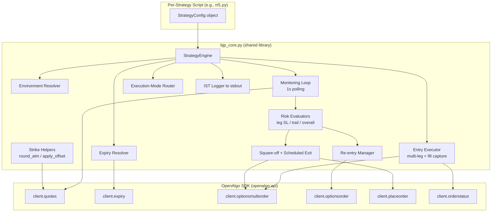

# Design Document

## Overview

This design translates the backtested AlgoTest portfolio "BJP COMPLETE TC" into 10 standalone Python strategy scripts that run inside the OpenAlgo Python Strategy Host (`/python`). Each script reproduces one portfolio strategy on NIFTY or SENSEX weekly options, using the OpenAlgo Python SDK for orders, expiry resolution, and live price monitoring, and APScheduler for IST-scheduled entry and exit.

The 10 strategies share a large amount of identical machinery: environment resolution, strike/expiry math, multi-leg entry, fill capture, a per-second monitoring loop, three leg-stop-loss flavors, leg trailing stops, Immediate/AtCost re-entry, overall MTM stop and trail, square-off-all, and execution-mode routing. The strategies differ only in **configuration** (index, offsets, lots, times, which risk controls are active, and their numeric thresholds).

### Design Approach: Shared Library + Thin Config Scripts

The design uses a **single shared library module** (`bjp_core.py`) that contains all reusable logic (a `StrategyEngine` class, configuration dataclasses, and pure helper functions), imported by **10 thin per-strategy scripts** that each declare only a configuration object and invoke the engine.

**Resolving the apparent conflict with Requirement 1.2.** Requirement 1.2 states each script must be executable standalone "without importing any other portfolio Strategy_Script." A `Strategy_Script` is defined in the glossary as "a single standalone Python file implementing exactly one of the 10 portfolio strategies." `bjp_core.py` is **not** one of the 10 strategies — it implements none of them on its own and is never scheduled or run directly. It is a supporting library, analogous to importing `openalgo` or `apscheduler`. Therefore importing `bjp_core` does not violate Requirement 1.2. Each of the 10 files remains independently runnable via `python <script>.py`, can be uploaded/started/stopped independently in the Strategy Host, and depends on no *other strategy* file.

**Why not fully self-contained files?** Duplicating ~800 lines of risk-engine logic across 10 files would make the portfolio unmaintainable: a single bug in the MTM computation or trail ratchet would need to be fixed 10 times, and fidelity drift between copies would be almost guaranteed. The shared-library approach keeps the risk engine defined once and tested once (property-based tests run against `bjp_core`), while the per-strategy files stay small enough to audit against the Requirement 19 parameter table at a glance.

**Standalone import mechanics.** Python automatically prepends the running script's own directory to `sys.path[0]`. When the Strategy Host launches `python NF1.py`, that script's directory is on the path, so a sibling `import bjp_core` resolves with no path manipulation and no package installation. All 11 files (`bjp_core.py` + 10 strategy scripts) live in one directory: `strategies/bjp_portfolio/`.

### File Layout

```
strategies/bjp_portfolio/
├── bjp_core.py                    # Shared library (NOT a strategy; never run directly)
├── nf_hedge.py                    # NF HEDGE
├── nf3_adjustable_strangle.py     # NF3_Adjustable_Strangle
├── nf2_mean_reversion.py          # NF2_Mean_reversion
├── nf1.py                         # NF1
├── sensex_hedge.py                # SENSEX HEDGE
├── sensex3_adjustable_strangle.py # SENSEX3_Adjustable_Strangle
├── sensex2_mean_reversion.py      # SENSEX2_Mean_reversion
├── sensex1.py                     # SENSEX1
├── nifty_1dte.py                  # NIFTY 1DTE
└── sensex_1dte.py                 # SENSEX 1DTE
```

The `strategies/` directory is excluded from Ruff linting per repo convention, so these files will not be linted by CI; nonetheless the code targets Python 3.12, 4-space indentation, and Google-style docstrings for readability.

### Concurrency Note

The main OpenAlgo Flask app has an asyncio/eventlet constraint, but that constraint applies to the main application process. These strategy scripts run as **isolated subprocesses** launched by `/python`, using standard `threading` (APScheduler's `BackgroundScheduler`) plus a synchronous polling loop. Because monitoring defaults to polling `client.quotes()` rather than an async WebSocket client, no event-loop conflict arises. The optional WebSocket mode uses the SDK's own callback threading and does not require the script to own an asyncio loop.

## Architecture

### Component Diagram



### Runtime Sequence

```mermaid
sequenceDiagram
    participant Host as /python Host
    participant S as Strategy Script
    participant Core as StrategyEngine
    participant SDK as OpenAlgo SDK

    Host->>S: launch subprocess (env injected)
    S->>Core: run(CONFIG)
    Core->>Core: resolve env, validate config
    Core->>Core: log name/index/mode/entry/exit
    Core->>Core: schedule entry & exit cron jobs (IST)
    Note over Core: keep process alive
    Core-->>SDK: (at Entry_Time) expiry() + quotes() for ATM
    Core-->>SDK: optionsmultiorder(non-momentum legs)
    Core-->>SDK: orderstatus() → avg fill prices
    loop every monitoring interval while legs open
        Core-->>SDK: quotes() per instrument
        Core->>Core: momentum → legSL → legTrail → overallSL → overallTrail
        Core-->>SDK: placeorder/optionsorder on triggers
    end
    Core-->>SDK: (at Exit_Time) square off all legs
    Core->>Core: log final MTM summary; stop loop
```

### Layered Responsibilities

| Layer | Responsibility | Requirements |
|-------|----------------|--------------|
| Config layer (10 scripts) | Declare exact backtest parameters; no logic | 1, 3, 19 |
| Environment resolver | API key, REST host, WS endpoint precedence | 2 |
| Config validator | Range/format checks, time ordering | 3, 16 |
| Strike/expiry helpers | ATM rounding, offset mapping, weekly expiry | 4, 5 |
| Entry executor | Multi-leg placement, fill capture, retries | 6, 7, 8, 17 |
| Monitoring loop | Fixed-cadence LTP fetch, ordered risk eval | 14 |
| Risk evaluators | Leg SL (3 flavors), leg trail, overall SL/trail, momentum | 9, 10, 11, 13 |
| Re-entry manager | Immediate/AtCost, counts, time cutoff | 12 |
| Exit manager | Square-off-all, scheduled exit, final summary | 15 |
| Execution router | Sandbox/live routing | 16 |
| Logger | IST-timestamped stdout events | 18 |

## Components and Interfaces

### 1. Environment Resolver

Resolves platform-injected configuration following Requirement 2 precedence.

```python
def resolve_environment() -> ResolvedEnv:
    """Resolve API key, REST host, and WebSocket endpoint from env.

    Returns:
        ResolvedEnv with api_key, host, ws_url (ws_url may be None).

    Raises:
        ConfigError: if OPENALGO_API_KEY is unset or empty (caller exits non-zero).
    """
```

Resolution rules:
- `api_key = OPENALGO_API_KEY` — if empty → log error, exit non-zero (Req 2.5).
- `host`: `HOST_SERVER` if non-empty, else `OPENALGO_HOST` if non-empty, else `http://127.0.0.1:5000` (Req 2.2).
- `ws_url`: `WEBSOCKET_URL` if non-empty, else construct `ws://{WEBSOCKET_HOST}:{WEBSOCKET_PORT}` from parts (Req 2.3). If WebSocket monitoring is enabled and parts are incomplete → log which var is missing, fall back to polling, do not exit (Req 2.4).

The SDK client is then created: `client = api(api_key=api_key, host=host, ws_url=ws_url)` (Req 2.6).

### 2. Config Validator

Validates a `StrategyConfig` before any trading begins. On any failure it logs the specific invalid parameter and returns without scheduling (Req 3.8, 3.9, 16.5).

- `lots`: integer 1–100 (Req 3.1).
- `index`: one of the supported index/exchange pairs (Req 3.3).
- `entry_time`, `exit_time`: `HH:MM:SS`, and `exit_time > entry_time` (Req 3.4, 3.8).
- `execution_mode`: `"sandbox"` or `"live"` (Req 16.5).
- `monitoring_interval`: numeric within 0.1–60s; out-of-range/non-numeric → log error and coerce to 1.0s default (Req 3.6, 14.2, 14.3).
- Environment variable overrides are applied before validation (Req 3.7).

### 3. Strike Helpers (pure functions)

```python
def round_atm(spot: float, step: int) -> int:
    """Round spot to nearest strike multiple; ties round upward.

    step is 50 for NIFTY, 100 for SENSEX (Req 4.4).
    """

def apply_offset(atm: int, step: int, offset: str, option_type: str) -> int:
    """Map an OpenAlgo offset (ATM/OTMn/ITMn) to an absolute strike.

    CE: OTM above ATM, ITM below ATM.
    PE: OTM below ATM, ITM above ATM. (Req 4.2, 4.3)
    Moves one strike step per offset unit.
    """
```

`round_atm` uses `math.floor(spot / step + 0.5)` to guarantee half-up rounding (avoids banker's rounding). The actual tradable option symbol is produced by the SDK's `optionsmultiorder`/`optionsorder` from the `offset` string; `apply_offset` is used for the **UnderlyingPoints** stop-loss baseline and for logging/validation, so its direction semantics must match the SDK.

### 4. Expiry Resolver

```python
def resolve_weekly_expiry(client, underlying: str, fno_exchange: str) -> str:
    """Return the current-week expiry string (earliest date >= today).

    Calls client.expiry(symbol, exchange=fno_exchange, instrumenttype="options")
    under a 10s timeout. (Req 5.1, 5.2)

    Raises:
        ExpiryError: non-success status, zero expiries, timeout, or all past. (Req 5.4, 5.5)
    """
```

- NIFTY → `NFO`, SENSEX → `BFO` (Req 5.1). Unsupported index → error, no expiry call (Req 5.3).
- Expiry strings parsed with the same multi-format parser used in `expiry_dates.py` (`%d-%b-%y`, `%d%b%y`, etc.), sorted chronologically; select earliest date on/after the current trading date (Req 5.2).
- The 10s timeout is enforced by running the SDK call in a worker thread with `future.result(timeout=10)`; timeout is treated as a resolution failure (Req 5.1, 5.4).

### 5. Entry Executor

Places all non-momentum legs in a single `optionsmultiorder` call, then captures fills.

```python
def place_entry(client, engine_state) -> None:
    """Place non-momentum legs, record symbol/orderid, fetch avg fill.

    - Single optionsmultiorder for all immediate legs (Req 7.1).
    - action SELL for short strategies, BUY for hedges; reject others (Req 7.2).
    - product from config or "NRML" default (Req 7.3).
    - read results[i].orderid / .symbol; missing field → leg failed (Req 7.4, 7.5).
    - orderstatus() up to 3x @2s until non-null average_price (Req 7.6, 7.7).
    - failed legs excluded from risk calc; placed legs preserved (Req 7.7, 7.8).
    - retry failed placement up to 3x (Req 6.5).
    """
```

Legs with a `PointsDown` momentum condition are **deferred** and handled by the monitoring loop (Req 6.4, 9).

The `legs` payload matches the SDK shape from `straddle_with_stops.py`:
```python
{"offset": "ITM2", "option_type": "CE", "action": "SELL", "quantity": qty,
 "product": "NRML", "pricetype": "MARKET", "splitsize": 0}
```
with `underlying`, `exchange` (index exchange, e.g. `NSE_INDEX`), and `expiry_date` passed to `optionsmultiorder`.

### 6. Monitoring Loop

```python
def monitor(engine_state) -> None:
    """Run the fixed-cadence risk loop while any leg is open (Req 14)."""
```

Each cycle (default 1.0s, configurable 0.1–60s):
1. Fetch LTP for every monitored instrument via `client.quotes()` (Req 14.1, 14.2). On fetch failure: log, retain last-known LTP and leg state, continue (Req 14.6).
2. Evaluate risk in strict precedence order (Req 14.7):
   **momentum entry → leg stop loss → leg trailing stop → overall stop loss → overall trailing stop**.
3. If any open leg has no fresh/known LTP, skip aggregate MTM this cycle and surface stale-data error (Req 13.6).

Optional WebSocket mode subscribes over `ws_url` and evaluates on each tick; on connect failure or drop it logs and falls back to polling without exiting (Req 14.4, 14.5).

### 7. Risk Evaluators

- **Leg stop loss** (Req 10): three flavors — `Points` (premium ≥ entry + P), `Percentage` (premium ≥ entry × (1 + X/100)), `UnderlyingPoints` (short CE: spot ≥ entry_spot + U; short PE: spot ≤ entry_spot − U). Trigger → square off leg via `placeorder`/`optionsorder`, retry ≤3, else keep open + error (Req 10.5, 10.6).
- **Leg trailing stop** (Req 11): initialize trail level at base leg-SL level (or entry fill if no base SL). For each complete `I`-point favorable fall in premium, lower the trail level by `S` and advance the reference by `I`. Trail level only moves downward (monotone, Req 11.3). When both base SL and trail apply, enforce the lower (more protective) level (Req 11.5).
- **Overall stop loss** (Req 13.1): aggregate MTM loss ≥ L → square off all open legs same cycle.
- **Overall trailing stop** (Req 13.2, 13.3): locked MTM stop initialized at overall-SL level; raised by `S` per complete `I` improvement above prior peak MTM; breach (MTM ≤ locked level) → square off all open legs same cycle.
- **Aggregate MTM** (Req 13.4): `Σ (entry − ltp)·qty` for short legs, `Σ (ltp − entry)·qty` for long legs.

### 8. Re-entry Manager

```python
def maybe_reenter(engine_state, leg) -> None:
    """Re-enter a stopped leg per Immediate/AtCost rules (Req 12)."""
```

- `Immediate`: on SL close, if completed count < configured count, re-enter at prevailing market price immediately (Req 12.1).
- `AtCost`: on SL close, monitor; when premium returns to original entry fill price, re-enter at that price (Req 12.2).
- Configured count ∈ {1, 3, 5}; completed re-entries never exceed it (Req 12.3).
- For NF3/SENSEX3, no re-entry at or after 13:59 IST (09:15 + 284 min) (Req 12.4).
- Each re-entry re-applies the leg's SL and trail (Req 12.5).

### 9. Exit Manager

- Square-off-all: when overall SL/trail triggers and `square_off_all_legs` is true, submit square-off for every open leg same cycle (Req 15.1); if false, close only designated legs (Req 15.2).
- Scheduled exit: at system time ≥ Exit_Time, square off every open leg regardless of other states (Req 15.3).
- When all legs confirmed closed → stop monitoring loop (Req 15.4) and log final realized MTM summary (Req 15.5).
- Failed square-off → log affected leg, re-submit each subsequent cycle until closed or process terminated (Req 15.6).

### 10. Execution-Mode Router

- Default `sandbox` when unconfigured (Req 16.1). Sandbox routes all orders through the OpenAlgo Analyzer and never to the live broker (Req 16.2). `live` routes to the broker only when explicitly enabled (Req 16.4). Startup logs the active mode (Req 16.3). Invalid mode → reject, no orders (Req 16.5). If live configured but platform analyzer state prevents live routing → log mismatch, follow platform effective mode (Req 16.6).

Mode is applied by toggling the OpenAlgo analyzer state via the SDK before placing orders (the platform's effective mode governs actual routing per Req 16.6).

### 11. Logger

`log_event(kind, **fields)` writes single-line, IST-timestamped records to stdout (captured by the host into `logs/strategies/`, Req 18.4). Every place/re-enter/square-off logs symbol, action, quantity, price context (Req 18.1); every SL/trail/overall trigger logs the condition and causing values (Req 18.2); SDK errors are logged and handled per the relevant requirement (Req 18.3).

## Data Models

### Configuration Dataclasses

```python
from dataclasses import dataclass, field
from enum import Enum

class OptionType(str, Enum):
    CE = "CE"
    PE = "PE"

class Action(str, Enum):
    BUY = "BUY"
    SELL = "SELL"

class SLKind(str, Enum):
    POINTS = "Points"
    PERCENTAGE = "Percentage"
    UNDERLYING_POINTS = "UnderlyingPoints"

class ReentryKind(str, Enum):
    IMMEDIATE = "Immediate"
    AT_COST = "AtCost"

class ExecutionMode(str, Enum):
    SANDBOX = "sandbox"
    LIVE = "live"

@dataclass
class LegStopLoss:
    kind: SLKind
    value: float                      # P points, X percent, or U underlying points

@dataclass
class LegTrailSL:
    instrument_move: float            # I > 0
    stoploss_move: float              # 0 < S <= I

@dataclass
class LegMomentum:
    points_down: float                # N points premium must fall before entry

@dataclass
class LegReentry:
    kind: ReentryKind
    count: int                        # one of 1, 3, 5

@dataclass
class LegConfig:
    option_type: OptionType
    action: Action
    offset: str                       # "ATM" | "OTMn" | "ITMn"
    stop_loss: LegStopLoss | None = None
    trail_sl: LegTrailSL | None = None
    momentum: LegMomentum | None = None
    reentry: LegReentry | None = None

@dataclass
class OverallStopLoss:
    mtm_rupees: float                 # L

@dataclass
class OverallTrailSL:
    instrument_move: float            # I
    stoploss_move: float              # S

@dataclass
class IndexSpec:
    name: str                         # "NIFTY" | "SENSEX"
    index_exchange: str               # "NSE_INDEX" | "BSE_INDEX"
    fno_exchange: str                 # "NFO" | "BFO"
    lot_size: int                     # 65 | 20
    strike_step: int                  # 50 | 100

@dataclass
class StrategyConfig:
    strategy_name: str
    index: IndexSpec
    lots: int                                     # 1..100
    entry_time: str                               # "HH:MM:SS" IST
    exit_time: str                                # "HH:MM:SS" IST
    legs: list[LegConfig]
    overall_stop_loss: OverallStopLoss | None = None
    overall_trail_sl: OverallTrailSL | None = None
    square_off_all_legs: bool = False
    reentry_time_restriction_min: int | None = None  # e.g., 284
    product: str = "NRML"
    execution_mode: ExecutionMode = ExecutionMode.SANDBOX
    monitoring_interval: float = 1.0
    use_websocket: bool = False

    @property
    def quantity(self) -> int:
        return self.lots * self.index.lot_size          # Req 3.2
```

### Runtime State

```python
@dataclass
class LegState:
    config: LegConfig
    symbol: str | None = None
    order_id: str | None = None
    entry_fill: float | None = None       # average_price from orderstatus
    entry_spot: float | None = None       # spot at entry (UnderlyingPoints baseline)
    last_ltp: float | None = None
    is_open: bool = False
    trail_level: float | None = None      # current trailing stop (monotone down)
    trail_ref: float | None = None        # last level at which trail advanced
    reentries_done: int = 0
    momentum_ref: float | None = None     # reference premium for PointsDown
    pending_momentum: bool = False        # awaiting momentum trigger
    exit_reason: str | None = None

@dataclass
class EngineState:
    config: StrategyConfig
    client: object
    expiry: str | None = None
    legs: list[LegState] = field(default_factory=list)
    entered_today: bool = False           # MaxPositionInADay = 1 (Req 6.3)
    peak_mtm: float = 0.0                  # for overall trail
    locked_mtm_stop: float | None = None   # overall trail locked level
    realized_mtm: float = 0.0
    running: bool = True
```

### Index Registry

| Index | index_exchange | fno_exchange | lot_size | strike_step |
|-------|----------------|--------------|----------|-------------|
| NIFTY | NSE_INDEX | NFO | 65 | 50 |
| SENSEX | BSE_INDEX | BFO | 20 | 100 |

### Per-Strategy Parameter Table (Requirement 19 + Requirement 8)

All 10 scripts encode exactly these values. "Legs" are CE + PE at the same offset unless noted.

| Script | Index | Action | Offset | Lots | Qty | Entry | Exit | Momentum | Leg SL | Leg Trail (I/S) | Reentry | Overall SL (MTM) | Overall Trail (I/S) | SqOffAll | Reentry cutoff |
|--------|-------|--------|--------|------|-----|-------|------|----------|--------|-----------------|---------|------------------|---------------------|----------|----------------|
| nf_hedge | NIFTY | BUY | OTM20 | 5 | 325 | 09:24 | 15:26 | — | none | none | none | none | none | — | — |
| sensex_hedge | SENSEX | BUY | OTM20 | 5 | 100 | 09:24 | 15:26 | — | none | none | none | none | none | — | — |
| nf3_adjustable_strangle | NIFTY | SELL | OTM6 | 1 | 65 | 09:16 | 15:22 | — | UnderlyingPoints 100 | none | Immediate ×3 | 1750 | 2000/2000 | true | 284 (13:59) |
| nf2_mean_reversion | NIFTY | SELL | ITM1 | 2 | 130 | 09:16 | 15:29 | PointsDown 10 | Percentage 20 | 20/2 | AtCost ×1 | 5600 | 6000/6000 | false | — |
| nf1 | NIFTY | SELL | ITM2 | 2 | 130 | 09:25 | 15:29 | — | Points 15 | 70/40 | AtCost ×1 | 5200 | 6000/9000 | false | — |
| sensex3_adjustable_strangle | SENSEX | SELL | OTM6 | 1 | 20 | 09:16 | 15:22 | — | UnderlyingPoints 350 | none | Immediate ×3 | 1500 | 6600/6600 | true | 284 (13:59) |
| sensex2_mean_reversion | SENSEX | SELL | ITM1 | 2 | 40 | 09:16 | 15:29 | PointsDown 35 | Percentage 20 | 65/5 | AtCost ×1 | 4900 | 20000/20000 | false | — |
| sensex1 | SENSEX | SELL | ITM2 | 2 | 40 | 09:25 | 15:29 | — | Points 50 | 230/130 | AtCost ×1 | 4600 | 20000/30000 | false | — |
| nifty_1dte | NIFTY | SELL | OTM10 | 5 | 325 | 09:18 | 15:23 | — | UnderlyingPoints 100 | none | Immediate ×5 | 5000 | none | true | — |
| sensex_1dte | SENSEX | SELL | OTM18 | 5 | 100 | 09:18 | 15:23 | — | UnderlyingPoints 350 | none | Immediate ×5 | 5000 | none | true | — |

Quantities derive from `lots × lot_size` (NIFTY 65, SENSEX 20) per Req 3.2. Hedge dependency (Req 17.2) is documented in each short script's module docstring: NF1/SENSEX1 (09:25) rely on NF/SENSEX HEDGE (09:24) being active.

### Thin Script Template

Each of the 10 scripts is structured like this (example `nf1.py`):

```python
#!/usr/bin/env python
"""NF1: short NIFTY ITM2 CE+PE strangle.

Depends on NF HEDGE (09:24 IST) being active for tail-risk protection (Req 17.2).
"""
import bjp_core as core

CONFIG = core.StrategyConfig(
    strategy_name="NF1",
    index=core.NIFTY,
    lots=2,
    entry_time="09:25:00",
    exit_time="15:29:00",
    legs=[
        core.LegConfig(core.OptionType.CE, core.Action.SELL, "ITM2",
                       stop_loss=core.LegStopLoss(core.SLKind.POINTS, 15),
                       trail_sl=core.LegTrailSL(70, 40),
                       reentry=core.LegReentry(core.ReentryKind.AT_COST, 1)),
        core.LegConfig(core.OptionType.PE, core.Action.SELL, "ITM2",
                       stop_loss=core.LegStopLoss(core.SLKind.POINTS, 15),
                       trail_sl=core.LegTrailSL(70, 40),
                       reentry=core.LegReentry(core.ReentryKind.AT_COST, 1)),
    ],
    overall_stop_loss=core.OverallStopLoss(5200),
    overall_trail_sl=core.OverallTrailSL(6000, 9000),
    square_off_all_legs=False,
)

if __name__ == "__main__":
    core.run(CONFIG)
```

## Correctness Properties

*A property is a characteristic or behavior that should hold true across all valid executions of a system — essentially, a formal statement about what the system should do. Properties serve as the bridge between human-readable specifications and machine-verifiable correctness guarantees.*

This feature is a strong fit for property-based testing because the risk engine in `bjp_core.py` is built from **pure functions** with clear input/output behavior: environment/config resolution, strike math, expiry selection, MTM computation, stop-loss thresholds, trail ratchets, and re-entry bounds. Each is exercised against a large generated input space. Infrastructure-facing criteria (SDK wiring, scheduler timing, deliverable file counts, logging channels) are covered by integration, example, and smoke tests instead, and are listed in the Testing Strategy.

The properties below were derived from the prework analysis and consolidated to remove redundancy (e.g., the three static leg-SL flavors collapse into one threshold property parameterized by flavor; trail monotonicity, step size, and min-selection collapse into one trail property; the three retry-bounded operations collapse into one retry-bound property).

### Property 1: Environment resolution follows precedence

*For any* combination of set, empty, and unset values for `HOST_SERVER`, `OPENALGO_HOST`, `WEBSOCKET_URL`, `WEBSOCKET_HOST`, and `WEBSOCKET_PORT`, the resolved REST host equals the first non-empty of (`HOST_SERVER`, `OPENALGO_HOST`, `http://127.0.0.1:5000`), and the resolved WebSocket endpoint equals `WEBSOCKET_URL` when non-empty, otherwise the endpoint constructed from `WEBSOCKET_HOST` and `WEBSOCKET_PORT`.

**Validates: Requirements 2.2, 2.3**

### Property 2: Total quantity is lots times lot size

*For any* number of lots in 1–100 and either index, the computed total quantity equals lots multiplied by the index lot size (65 for NIFTY, 20 for SENSEX), and is a positive integer multiple of the lot size.

**Validates: Requirements 3.2, 7.1**

### Property 3: Invalid configuration is rejected and never begins trading

*For any* configuration in which at least one field is out of range or malformed (lots outside 1–100, entry/exit not valid `HH:MM:SS`, `exit_time` not later than `entry_time`, or execution mode not one of sandbox/live), validation fails, an error identifying the offending parameter is produced, and no entry orders are placed.

**Validates: Requirements 3.1, 3.4, 3.8, 3.9, 16.5**

### Property 4: Environment overrides take precedence over in-script defaults

*For any* configuration key that also has a corresponding environment variable set to a valid value, the effective configuration value equals the environment value rather than the in-script default.

**Validates: Requirements 3.7**

### Property 5: Monitoring interval is validated and defaulted

*For any* configured monitoring interval value (numeric or non-numeric), the effective interval equals the configured value when it is numeric and within 0.1–60 seconds inclusive, and equals the default of 1.0 second otherwise.

**Validates: Requirements 3.6, 14.2, 14.3**

### Property 6: Strike-type to offset mapping preserves token and distance

*For any* integer distance n from 0 to 50 and any direction token, mapping `StrikeType.OTM<n>` yields `OTM<n>`, `StrikeType.ITM<n>` yields `ITM<n>`, and `StrikeType.ATM` yields `ATM`, preserving both the direction token and the integer distance.

**Validates: Requirements 4.1**

### Property 7: Offset direction is correct per option type

*For any* at-the-money reference strike, strike step, and offset distance n, a CE `OTM<n>` resolves to `atm + n·step` and CE `ITM<n>` to `atm − n·step`, while a PE `OTM<n>` resolves to `atm − n·step` and PE `ITM<n>` to `atm + n·step`; `ATM` resolves to `atm` for both.

**Validates: Requirements 4.2, 4.3**

### Property 8: ATM rounding is nearest multiple with ties rounding up

*For any* positive spot price and strike step in {50, 100}, the computed ATM reference is an exact multiple of the step, its absolute distance from the spot is at most half the step, and a spot exactly halfway between two multiples rounds up to the higher multiple.

**Validates: Requirements 4.4**

### Property 9: Weekly expiry is the earliest date on or after today

*For any* non-empty list of expiry date strings, the selected current-week expiry is the earliest date that is on or after the current trading date; when no such date exists, expiry resolution fails and no entry orders are placed.

**Validates: Requirements 5.2, 5.5**

### Property 10: At most one entry per trading day

*For any* number of entry-trigger firings within a single trading day, the strategy places its entry position at most once, honoring MaxPositionInADay = 1, leaving an existing position unchanged on subsequent triggers.

**Validates: Requirements 6.3**

### Property 11: Retry attempts are bounded by three

*For any* sequence of failing SDK operations for entry-leg placement, average-fill retrieval, or square-off, the number of attempts never exceeds 3, the operation stops retrying on the first success, and successfully placed/recorded legs are preserved.

**Validates: Requirements 6.5, 7.6, 10.6**

### Property 12: Default product resolution

*For any* configuration, the product type sent per leg equals the configured product when one is provided and equals `NRML` when none is configured.

**Validates: Requirements 7.3**

### Property 13: Hedge strategies never exit early

*For any* sequence of LTP and spot values between entry and exit, a Hedge_Strategy applies no leg stop loss, leg trail, re-entry, overall stop loss, or overall trail, and keeps all its legs open until Exit_Time.

**Validates: Requirements 8.3, 8.4**

### Property 14: Momentum gating enters only after the required fall

*For any* candidate momentum leg with reference premium R and threshold N, and any price path within the entry–exit window, the leg's entry order is placed if and only if the LTP reaches or falls below `R − N` during the window, and is never placed while the LTP stays above `R − N`.

**Validates: Requirements 9.2, 9.3**

### Property 15: Leg stop loss triggers exactly at its threshold

*For any* open short leg, its stop loss triggers a square-off if and only if the adverse level is reached: for a `Points` SL when leg premium ≥ entry fill + P; for a `Percentage` SL when leg premium ≥ entry fill × (1 + X/100); for an `UnderlyingPoints` SL on a short CE when spot ≥ entry spot + U and on a short PE when spot ≤ entry spot − U; and for an active trailing stop when leg premium ≥ the current trailing level.

**Validates: Requirements 10.1, 10.2, 10.3, 10.4, 11.4**

### Property 16: Leg trailing stop is monotone and correctly stepped

*For any* price path of a profitable short leg, the trailing stop level is non-increasing over time (never loosened), the number of downward advances equals the number of complete `I`-point falls below the last advance reference, the trailing level equals its initial level minus (advances × S), and when a base stop loss also applies the effective stop equals the more protective (lower) of the base and trailing levels.

**Validates: Requirements 11.2, 11.3, 11.5**

### Property 17: Re-entry count is bounded

*For any* sequence of stop-loss closes on a re-entering leg, the number of completed re-entries never exceeds the configured count (one of 1, 3, or 5).

**Validates: Requirements 12.3**

### Property 18: AtCost re-entry occurs at the original fill price

*For any* AtCost leg that has closed on stop loss with remaining re-entry budget, a re-entry is placed if and only if the leg premium returns to its original entry fill price within the trading window, and the re-entry uses that original fill price.

**Validates: Requirements 12.2**

### Property 19: Re-entry time restriction is enforced

*For any* evaluation time, a re-entry for an NF3/SENSEX3 leg is permitted if and only if the current time is strictly before the cutoff of 284 minutes after 09:15 IST (13:59 IST).

**Validates: Requirements 12.4**

### Property 20: Aggregate MTM has correct per-leg sign

*For any* set of open legs with entry fills, quantities, and current LTPs, the aggregate MTM equals the sum over short legs of (entry fill − LTP) × quantity plus the sum over long legs of (LTP − entry fill) × quantity.

**Validates: Requirements 13.4**

### Property 21: Overall square-off triggers when MTM breaches the active level

*For any* aggregate MTM value, an overall square-off of all open legs is triggered if and only if the aggregate MTM loss reaches or exceeds the overall stop-loss level L, or the aggregate MTM falls to or below the locked overall-trailing level.

**Validates: Requirements 13.1, 13.3**

### Property 22: Overall trailing lock is monotone and correctly stepped

*For any* path of aggregate MTM values, the locked overall-trailing stop is initialized at the overall stop-loss level, is non-decreasing over time, and is raised by (number of complete `I`-point improvements above the prior peak MTM) × S.

**Validates: Requirements 13.2**

### Property 23: Risk evaluation respects precedence order

*For any* engine state in which two or more risk conditions are simultaneously satisfiable, the action taken corresponds to the earliest condition in the precedence order momentum entry → leg stop loss → leg trailing stop → overall stop loss → overall trailing stop.

**Validates: Requirements 14.7**

### Property 24: Square-off scope matches configuration

*For any* strategy with open legs, when an overall stop-loss or overall-trailing trigger fires, every open leg is squared off within that cycle when `square_off_all_legs` is true, and only the legs designated for the trigger are squared off (others left unchanged) when it is false.

**Validates: Requirements 15.1, 15.2**

### Property 25: Scheduled exit closes everything

*For any* engine state at a system time at or after Exit_Time, square-off orders are submitted for every open leg regardless of `square_off_all_legs`, overall stop-loss, or overall-trailing state.

**Validates: Requirements 15.3**

### Property 26: Execution mode defaults to sandbox

*For any* configuration, the effective execution mode equals the configured value when it is one of sandbox or live, and equals sandbox when unconfigured; an invalid mode value is rejected without placing orders.

**Validates: Requirements 16.1, 16.5**

## Error Handling

Error handling follows a "fail safe, keep monitoring" philosophy: configuration and pre-trade errors abort before any order is placed, while in-flight data/order errors are retried and logged without killing the monitoring loop (so open positions are never abandoned mid-session).

| Condition | Handling | Requirement |
|-----------|----------|-------------|
| Missing `OPENALGO_API_KEY` | Log error, exit non-zero, place no orders | 2.5 |
| WS parts incomplete (WS enabled) | Log missing var, fall back to polling, do not exit | 2.4, 14.5 |
| Invalid config field / bad time ordering | Log offending parameter, do not begin trading | 3.8, 3.9, 16.5 |
| Invalid monitoring interval | Log error, coerce to 1.0s default | 3.6, 14.3 |
| `quotes()` error/empty at strike selection | Abort strike selection, no order, surface error | 4.5 |
| Expiry non-success / zero / >10s / all past | Log cause, place no entry orders | 5.1, 5.4, 5.5 |
| Unsupported index | Log error, no expiry call, no orders | 5.3 |
| Entry leg placement failure | Retry ≤3; preserve placed legs; report affected leg | 6.5, 7.8 |
| Missing symbol/orderid in entry result | Mark leg failed, retain other leg data | 7.5 |
| `orderstatus()` no avg fill after 3 tries | Exclude leg from risk calc, keep symbol/orderid | 7.7 |
| Invalid resolved leg action (not SELL/BUY) | Reject entry, log invalid action | 7.2 |
| Momentum reference LTP unavailable at entry | Do not enter leg, surface error | 9.4 |
| Leg square-off failure | Retry ≤3; if all fail keep leg open + error | 10.6 |
| LTP fetch failure on a cycle | Log, retain last-known LTP + leg state, continue | 14.6 |
| Missing LTP for an open leg | Skip aggregate MTM this cycle, surface stale-data error | 13.6 |
| Overall square-off partial failure | Retry remaining legs, report which stay open | 13.5 |
| Scheduled-exit square-off failure | Re-submit each subsequent cycle until closed | 15.6 |
| Any SDK call raises | Log message, continue per relevant requirement | 18.3 |
| Live mode blocked by platform analyzer state | Log mismatch, follow platform effective mode | 16.6 |

All error logs are IST-timestamped single lines to stdout (Req 18) so the host log viewer can correlate them with the backtest.

## Testing Strategy

### Dual Approach

- **Property-based tests** verify the universal correctness properties above against the pure logic in `bjp_core.py` (config/env resolution, strike math, expiry selection, MTM, stop-loss thresholds, trail ratchets, re-entry bounds, precedence, square-off scope).
- **Unit / example tests** verify specific behaviors, parsing, and initialization steps.
- **Edge-case tests** verify error branches and boundary conditions (many are covered by property generators that include boundary inputs).
- **Integration tests** verify SDK wiring and scheduler behavior using mocks.
- **Smoke tests** verify deliverable structure and configuration fidelity.

### Property-Based Testing Configuration

- Library: **Hypothesis** (the standard PBT library for Python; do not hand-roll generators/shrinking).
- Each property from the Correctness Properties section is implemented by a **single** Hypothesis test.
- Minimum **100 iterations** per property test (`@settings(max_examples=100)` or higher).
- SDK interactions inside property tests use mocks/fakes (in-memory client) so 100+ iterations stay fast and free of network cost.
- Each property test carries a tag comment referencing its design property:
  `# Feature: bjp-portfolio-strategies, Property {number}: {property_text}`
- Generators cover boundary inputs explicitly: spot at exact half-step (Property 8), premium exactly at threshold (Property 15), time exactly at the 13:59 cutoff (Property 19), MTM exactly at L (Property 21), and zero-fall / large-fall trail paths (Property 16).

### Example / Unit Tests

- Startup logging contains name/index/mode/entry/exit (Req 1.4); active mode logged (Req 16.3).
- Entry result parsing records symbol/orderid (Req 7.4); trail level initialization (Req 11.1).
- Immediate re-entry at market and SL/trail re-application after re-entry (Req 12.1, 12.5).
- On trigger, square-off placed and leg marked closed (Req 10.5); loop stops when all closed (Req 15.4); final MTM summary logged (Req 15.5).
- Action logs include symbol/action/qty/price and trigger logs include causing values (Req 18.1, 18.2).

### Edge-Case Tests

- Missing API key exit (2.5); WS fallback (2.4, 14.5); quotes empty at strike selection (4.5); expiry failure modes (5.3, 5.4); missing/omitted fill fields (7.5, 7.7); momentum LTP missing at entry (9.4); momentum unmet at exit (9.5); missing LTP skips MTM (13.6); partial square-off failure (13.5); scheduled-exit resubmission (15.6); SDK exception continuation (18.3).

### Integration Tests (mocked SDK)

- Client initialized with resolved api_key/host/ws_url (2.6).
- `expiry()` called with correct FNO exchange and 10s timeout enforced (5.1).
- `optionsmultiorder` payload has correct underlying/exchange/expiry/offset/option_type/action/quantity/product/pricetype (7.1).
- Entry placed within 5s of trigger (6.2); WS ticks drive risk evaluation and drop→polling fallback (14.4, 14.5).
- Live-vs-platform effective mode routing (16.6).

### Smoke Tests

- Exactly 10 strategy files exist with the required names and import cleanly (1.1); no cross-strategy imports (1.2).
- Scheduler timezone is `Asia/Kolkata` (6.1); logs write to stdout (18.4).
- **Parameter fidelity (table-driven):** each script's `CONFIG` matches the Per-Strategy Parameter Table exactly — offset, lots, quantity, entry/exit, momentum, leg SL flavor/value, trail I/S, re-entry kind/count, overall SL, overall trail I/S, square-off-all, and re-entry cutoff (Req 8.1, 8.2, 17.1, 19.1–19.10). Each short script's docstring documents its hedge dependency (17.2).

### Not Using PBT (and why)

- SDK/broker wiring, scheduler timing, WebSocket transport → external behavior that does not vary meaningfully with generated input; covered by mocked integration tests.
- File-count/deliverable structure, timezone config, stdout channel, parameter-table fidelity → one-time/deterministic checks; covered by smoke tests.
- Logging content → example tests asserting fields are present.
